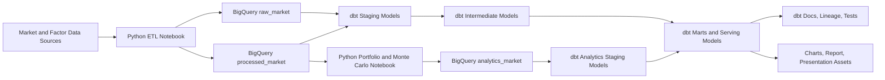

# Argentina Portfolio Risk Intelligence Pipeline

This project is a Big Data Technologies university assignment focused on Argentine equity and portfolio analytics. It combines Python notebooks, Google BigQuery, and dbt Core to ingest market data, engineer financial features, build portfolio intelligence models, and publish simulation-ready and dashboard-ready outputs. The result is a hybrid analytics pipeline that supports both quantitative research and warehouse governance through testing, documentation, lineage, and serving models.

## 1. Project Overview

The project analyzes Argentine stocks and user-defined portfolios in order to evaluate risk, return, diversification, and downside exposure. It brings together raw market data, factor proxies, portfolio analytics, and Monte Carlo simulation outputs into a structured warehouse workflow.

The main value of the project is not only the calculation of financial metrics, but the creation of a reproducible analytics lifecycle:

- ingest raw stock and factor data
- store and organize it in BigQuery
- transform and document it with dbt
- generate portfolio and scenario intelligence
- serve final outputs for academic reporting, dashboards, and presentation assets

Argentine markets are an especially interesting case because local assets are strongly affected by exchange-rate pressure, macro volatility, market concentration, and country-specific risk. That makes portfolio analysis more challenging and more meaningful than a simple single-market equity study.

The final outputs are intended to help answer investor-oriented questions such as which stocks look strongest on a risk-adjusted basis, how concentrated a portfolio is, how exposed it is to MERVAL and FX dynamics, and how severe downside risk could be under simulation.

## 2. Objectives and Research / Business Questions

The project is designed to answer the following questions:

- Which Argentine equities offer the best historical risk-return tradeoff?
- How do MERVAL exposure, FX sensitivity, and factor behavior affect portfolio outcomes?
- How concentrated or diversified is a given portfolio?
- How do volatility, Sharpe ratio, beta, and drawdown change across assets and portfolios?
- Which portfolios are better aligned with conservative, balanced, or aggressive investor profiles?
- How does portfolio downside risk behave under Monte Carlo simulation?
- What do VaR-, CVaR-, and probability-of-loss-style metrics suggest about portfolio fragility?

From a business and academic perspective, the project demonstrates how warehouse engineering and quantitative analytics can be combined to support investor decision support in an emerging-market setting.

## 3. Architecture Summary

This repository uses a hybrid architecture:

- Python notebooks handle ingestion, feature engineering, and simulation-heavy analytics.
- BigQuery acts as the warehouse for raw, processed, and analytics data.
- dbt Core manages transformation logic, data quality testing, documentation, lineage, and serving models.

Plain-language workflow:

`market data -> Python notebooks -> BigQuery raw layer -> notebook processed tables -> dbt staging -> dbt intermediate models -> dbt marts / serving layer -> Monte Carlo-enriched outputs -> charts, docs, and academic deliverables`

### Text Pipeline

`yfinance + factor proxies -> Python ETL notebook -> BigQuery raw_market / processed_market -> dbt staging / intermediate / marts -> Python analytics notebook -> analytics_market -> dbt serving marts -> charts, docs, report inputs`

### Mermaid Diagram



## 4. Tools and Technologies Used

| Tool / Technology | What it does in the project | Why it was chosen |
| --- | --- | --- |
| Python | Core language for ingestion, feature engineering, and analytics logic | Flexible for financial analysis, data engineering, and simulation workflows |
| Jupyter notebooks | Hosts the ETL and analytics stages | Good fit for an academic project that combines code, explanation, and iterative analysis |
| pandas | Tabular data preparation and transformation | Standard library for time-series and financial data wrangling |
| numpy | Numerical operations and simulation support | Efficient array-based computations for returns and Monte Carlo logic |
| yfinance | Pulls historical stock and factor market data | Practical, fast, and accessible for academic market-data ingestion |
| statsmodels | Supports statistical and regression-style analytics where needed | Useful for beta, CAPM-style, or econometric calculations |
| matplotlib | Produces the portfolio and simulation charts saved to `outputs/charts/` | Simple and reliable for report-ready visual outputs |
| BigQuery | Warehouse for raw, processed, and analytics data | Scalable cloud warehouse that fits Big Data coursework and SQL-based transformations |
| dbt Core | Manages warehouse transformations | Makes the pipeline more modular, testable, documented, and academically defensible |
| dbt docs | Generates model documentation and lineage graph | Important for showing transformation ownership, lineage, and project organization |
| Google Cloud authentication | Grants notebook and dbt access to BigQuery | Required to run the end-to-end warehouse workflow |
| VS Code or similar IDE | Development environment for notebooks, SQL, and configuration files | Practical local workspace for a multi-tool data project |

## 5. Project Structure

The repository is organized so that notebooks, warehouse models, test logic, and output artifacts map clearly to the data lifecycle.

```text
bigdata-merval-analysis/
├── 02_transform_serve_montecarlo.ipynb
├── merval_analysis.ipynb
├── README.md
├── requirements.txt
├── dbt_project.yml
├── profiles.yml
├── docs/
├── macros/
│   ├── accepted_range.sql
│   ├── expression_is_true.sql
│   └── unique_combination_of_columns.sql
├── models/
│   ├── sources.yml
│   ├── schema.yml
│   ├── staging/
│   ├── intermediate/
│   └── marts/
├── outputs/
│   └── charts/
│       ├── final_value_distribution.png
│       ├── monte_carlo_paths.png
│       ├── return_contribution.png
│       └── risk_contribution.png
├── tests/
│   ├── correlation_self_pairs_are_one.sql
│   └── portfolio_weights_sum_to_one.sql
├── logs/            # generated after dbt commands
└── target/          # generated dbt artifacts and docs assets
```

### What Each Folder Stores

| Folder | What it contains | Why it matters |
| --- | --- | --- |
| `models/` | dbt SQL models and YAML metadata | Central transformation, testing, documentation, and serving logic |
| `models/staging/` | Standardized entry models over raw and notebook-produced sources | Cleans names, types, grains, and source contracts |
| `models/intermediate/` | Reusable business-logic models | Builds return, factor, diversification, and portfolio intelligence layers |
| `models/marts/` | Final serving models | Publishes investor-facing outputs for reports, dashboards, and documentation |
| `macros/` | Custom dbt generic tests | Adds reusable business-rule validation beyond built-in `not_null` and `unique` |
| `tests/` | Singular dbt tests | Validates portfolio-specific rules like weight normalization and correlation sanity |
| `outputs/charts/` | Saved visual outputs | Stores report-ready charts from the analytics notebook |
| `docs/` | Documentation support directory | Reserved for architecture notes, screenshots, or academic support materials |
| `logs/` | dbt execution logs | Useful for debugging runs, tests, and warehouse errors |
| `target/` | dbt compiled SQL, manifest, catalog, docs assets | Generated artifacts used for dbt docs and debugging |

## 6. File-by-File Explanation

### Root Files

| File | What it is | What it does | Why it matters |
| --- | --- | --- | --- |
| `README.md` | Project guide | Explains architecture, workflow, tools, and deliverables | First reference for professors, teammates, and reviewers |
| `requirements.txt` | Python dependency list | Defines notebook and dbt package requirements | Makes the environment reproducible |
| `dbt_project.yml` | dbt project configuration | Declares model paths, materializations, schemas, and dbt behavior | Controls how the transformation layer is built |
| `profiles.yml` | dbt connection profile template | Points dbt to the BigQuery project, dataset, and auth method | Required for dbt to connect to the warehouse |
| `merval_analysis.ipynb` | ETL and feature-engineering notebook | Ingests raw data, engineers processed financial tables, and uploads them to BigQuery | Starts the warehouse lifecycle |
| `02_transform_serve_montecarlo.ipynb` | Analytics and serving notebook | Reads processed BigQuery inputs, builds portfolio analytics, runs Monte Carlo simulation, and writes analytics tables | Produces the right-side analytics outputs |

### dbt Metadata Files

| File | Purpose |
| --- | --- |
| `models/sources.yml` | Declares BigQuery source tables in `raw_market`, `processed_market`, and `analytics_market`, including source tests and descriptions |
| `models/schema.yml` | Documents dbt models, columns, grains, and business-rule tests across staging, intermediate, and mart layers |

### dbt Macro Files

| File | Purpose |
| --- | --- |
| `macros/accepted_range.sql` | Generic test for numeric bounds such as volatility `>= 0` or probability between `0` and `1` |
| `macros/expression_is_true.sql` | Generic test for logical constraints such as ordered ticker pairs |
| `macros/unique_combination_of_columns.sql` | Generic composite-key uniqueness test for grains like `date + ticker` or `portfolio_id + run_id` |

### Singular Test Files

| File | Purpose |
| --- | --- |
| `tests/portfolio_weights_sum_to_one.sql` | Confirms that configured portfolio weights sum to 1 |
| `tests/correlation_self_pairs_are_one.sql` | Checks that self-correlations equal 1 in the canonical correlation model |

### Representative dbt SQL Models

| File | Layer | What it does |
| --- | --- | --- |
| `models/staging/stg_stock_prices.sql` | Staging | Deduplicates and standardizes raw stock prices |
| `models/staging/stg_factor_prices.sql` | Staging | Standardizes raw factor-price inputs |
| `models/staging/stg_asset_returns.sql` | Staging | Standardizes processed notebook return features |
| `models/staging/stg_portfolio_scenarios.sql` | Staging | Standardizes notebook portfolio scenario outputs and handles source-schema drift |
| `models/intermediate/int_asset_returns.sql` | Intermediate | Reconciles processed return data with raw prices |
| `models/intermediate/int_portfolio_return_series.sql` | Intermediate | Builds daily portfolio performance, cumulative return, and drawdown |
| `models/intermediate/int_factor_exposure.sql` | Intermediate | Links portfolio composition to factor context and exposures |
| `models/intermediate/int_diversification_metrics.sql` | Intermediate | Calculates concentration and diversification statistics using the correlation matrix |
| `models/intermediate/int_risk_breakdown.sql` | Intermediate | Combines volatility, beta, diversification, and risk labels |
| `models/marts/mart_stock_rankings.sql` | Mart | Produces stock-level rankings for risk-adjusted comparisons |
| `models/marts/mart_portfolio_scenarios.sql` | Mart | Publishes one-row portfolio scenario summaries |
| `models/marts/mart_monte_carlo_summary.sql` | Mart | Publishes simulation summary metrics enriched with dbt-owned portfolio context |
| `models/marts/mart_investor_dashboard.sql` | Mart | Final wide serving model for dashboards, screenshots, and report-ready outputs |

## 7. Notebook Guide

This project contains two major notebooks that should be run in sequence.

### `merval_analysis.ipynb`

- Pipeline stage: ingestion and feature engineering
- Main purpose: collect and prepare stock and factor data for warehouse use

This notebook ingests Argentine stock history and factor proxies such as MERVAL, USDARS, VIX, EEM, and risk-free-style signals. It computes processed financial outputs such as returns, stock metrics, beta metrics, and correlation data, then uploads both raw and processed tables into BigQuery.

Key outputs from this notebook are `raw_market.stock_prices`, `raw_market.factor_prices`, `processed_market.asset_returns`, `processed_market.factor_returns`, `processed_market.stock_metrics`, `processed_market.beta_metrics`, and `processed_market.correlation_matrix_long`.

### `02_transform_serve_montecarlo.ipynb`

- Pipeline stage: analytics, simulation, and analytics-layer publication
- Main purpose: read processed BigQuery inputs, build portfolio analytics, and generate Monte Carlo outputs

This notebook validates processed BigQuery inputs, computes portfolio-level return and risk summaries, classifies portfolio profiles, runs Monte Carlo simulation, calculates metrics such as probability of loss, VaR, and CVaR, writes analytics tables back to BigQuery, and produces charts for the final report.

Key outputs from this notebook are `analytics_market.portfolio_scenarios`, `analytics_market.monte_carlo_summary`, and the chart files stored in `outputs/charts/`.

## 8. Data Layers and Warehouse Design

The warehouse is organized into three conceptual layers.

### Raw Layer

The raw layer stores landed market observations with minimal transformation.

Examples:

- `raw_market.stock_prices`
- `raw_market.factor_prices`

This layer is useful for traceability, reloads, and proving that the project preserves the original warehouse entrypoint before applying analytics logic.

### Processed Layer

The processed layer contains notebook-engineered financial datasets that are cleaned enough to be reused downstream.

Examples:

- `processed_market.asset_returns`
- `processed_market.factor_returns`
- `processed_market.stock_metrics`
- `processed_market.beta_metrics`
- `processed_market.correlation_matrix_long`

This is the bridge between ingestion and governed warehouse transformation.

### Analytics / Serving Source Layer

The analytics layer contains notebook-produced scenario and simulation outputs that dbt stages and enriches into final serving marts.

Examples:

- `analytics_market.portfolio_scenarios`
- `analytics_market.monte_carlo_summary`

This layer is important because it allows the project to preserve notebook-based quantitative work while still making dbt the owner of final serving logic, testing, and documentation.

## 9. dbt Workflow

dbt is the warehouse transformation and governance layer of the project.

### Why dbt is important here

- It turns warehouse logic into modular SQL models instead of leaving it implicit in notebooks.
- It creates a lineage graph that explains how raw data becomes investor-facing outputs.
- It adds tests that check grain, nullability, relationships, ranges, and business rules.
- It documents sources, models, and columns in a format that is appropriate for academic review.

### dbt Layers in This Project

| Layer | Purpose |
| --- | --- |
| Staging models | Standardize and clean source contracts from raw and notebook-produced tables |
| Intermediate models | Build reusable business logic such as asset returns, portfolio weights, factor exposure, diversification, and risk breakdown |
| Mart models | Publish final serving outputs such as stock rankings, portfolio scenarios, Monte Carlo summaries, and dashboard-ready tables |

### What the Lineage Graph Represents

The dbt docs graph tells the story:

`raw market data -> staged contracts -> financial metrics -> portfolio intelligence -> simulation-enriched serving layer`

That is academically stronger than a graph that only documents notebook outputs without transforming them.

### Hybrid Architecture Statement

Python handles ingestion and simulation-heavy analytics, while dbt handles warehouse transformations, tests, documentation, lineage, and final serving models.

## 10. How BigQuery Fits Into the Workflow

BigQuery is the central storage and SQL execution layer of the project.

It is used to:

- store raw market and factor data
- store notebook-produced processed financial outputs
- store notebook-produced analytics outputs
- host dbt-managed staging, intermediate, and mart models
- provide a warehouse backbone for documentation, testing, and serving

Without BigQuery, the project would remain notebook-centric. With BigQuery, it becomes a proper warehouse-backed analytics pipeline.

## 11. How Monte Carlo Simulation Fits Into the Workflow

Monte Carlo simulation is the downside-risk and scenario-analysis component of the project.

It is used to:

- model possible future portfolio paths
- estimate terminal portfolio-value distributions
- compute probability of loss
- compute VaR and CVaR style risk metrics
- complement historical analytics with forward-looking scenario logic

In this project, the simulation is computed in the analytics notebook and written to `analytics_market.monte_carlo_summary`. dbt then stages and enriches that output so it becomes part of the governed serving layer instead of a disconnected notebook artifact.

## 12. Pipeline Walkthrough

The end-to-end pipeline can be understood in eight steps:

1. Collect historical stock and factor data relevant to Argentine portfolio analysis.
2. Ingest and clean those inputs in the ETL notebook.
3. Load raw and processed financial tables into BigQuery.
4. Use dbt staging models to standardize raw and notebook-produced source contracts.
5. Use dbt intermediate models to compute portfolio weights, return series, factor exposure, diversification metrics, and risk breakdowns.
6. Run the analytics notebook to produce scenario summaries and Monte Carlo outputs.
7. Use dbt marts to build final serving models such as stock rankings, portfolio scenarios, Monte Carlo summaries, and dashboard-ready outputs.
8. Generate dbt tests and docs so the final project includes validated transformations, lineage, and documentation for academic review.

## 13. Key Outputs and Deliverables

### BigQuery Tables

Representative warehouse outputs include:

- raw market tables
- processed return and metric tables
- analytics scenario and simulation tables
- dbt-built intermediate and mart tables

### dbt Serving Models

The most important final models are:

- `mart_stock_metrics`
- `mart_stock_rankings`
- `mart_portfolio_return_series`
- `mart_factor_exposure_summary`
- `mart_diversification_summary`
- `mart_portfolio_risk_breakdown`
- `mart_portfolio_scenarios`
- `mart_monte_carlo_summary`
- `mart_investor_dashboard`

### Charts and Visual Outputs

Saved visual outputs currently include:

- `outputs/charts/monte_carlo_paths.png`
- `outputs/charts/final_value_distribution.png`
- `outputs/charts/return_contribution.png`
- `outputs/charts/risk_contribution.png`

### Academic Deliverables

The project also produces:

- a documented warehouse model graph
- tested transformation logic
- report-ready portfolio and simulation tables
- presentation-ready charts and architecture narrative

## 14. How to Run the Project

### Prerequisites

- Python 3.11 or 3.12 is recommended
- Google Cloud access to the target BigQuery project
- dbt Core and dbt BigQuery installed through `requirements.txt`

### 1. Create and activate an environment

For a single environment:

```bash
python3.12 -m venv .venv
source .venv/bin/activate
pip install --upgrade pip
pip install -r requirements.txt
```

For a cleaner hybrid setup, you can keep notebooks and dbt in separate environments:

```bash
python3.12 -m venv .venv
python3.12 -m venv .dbt_env
source .venv/bin/activate
pip install -r requirements.txt
source .dbt_env/bin/activate
pip install -r requirements.txt
```

### 2. Configure Google Cloud authentication

Option A: Application Default Credentials

```bash
gcloud auth application-default login
```

Option B: Service account

```bash
export GOOGLE_APPLICATION_CREDENTIALS=/path/to/service-account.json
```

### 3. Configure dbt profile

Update `profiles.yml` so dbt points to the correct:

- GCP project
- dataset
- authentication method
- location

### 4. Run the notebooks in order

```bash
jupyter notebook
```

Then run:

1. `merval_analysis.ipynb`
2. `02_transform_serve_montecarlo.ipynb`

This order matters because the second notebook depends on processed tables created by the first.

### 5. Run dbt

If using a dedicated dbt environment:

```bash
source .dbt_env/bin/activate
```

Then run:

```bash
dbt debug --profiles-dir .
dbt build --profiles-dir .
dbt docs generate --profiles-dir .
dbt docs serve --profiles-dir .
```

If you prefer separate commands:

```bash
dbt run --profiles-dir .
dbt test --profiles-dir .
```

### Recommended execution order

```bash
source .dbt_env/bin/activate
dbt debug --profiles-dir .
dbt build --profiles-dir .
dbt docs generate --profiles-dir .
```

## 15. Project Strengths and Limitations

### Strengths

- Clear hybrid architecture that separates notebook-heavy computation from warehouse transformation governance
- Layered BigQuery design with raw, processed, and analytics source layers
- Strong dbt lineage and documentation for academic review
- Business-rule tests for financial and portfolio logic
- Investor-oriented outputs rather than only exploratory notebook analysis
- Monte Carlo integration that strengthens the risk-analysis narrative

### Limitations

- Some upstream processed and analytics tables are notebook-dependent rather than fully dbt-generated
- Data coverage is limited to the selected assets and factor proxies used in the assignment
- Portfolio weights are currently configured through dbt vars rather than a fully dynamic portfolio-input table
- Simulation assumptions are simplified compared with institutional-grade risk engines
- The project does not yet include a live dashboard or automated scheduled orchestration

### Future Improvements

- Add broader macro and inflation-adjusted factor coverage
- Introduce portfolio input tables instead of hardcoded weight vars
- Add richer scenario stress tests beyond Monte Carlo
- Support live or scheduled ingestion
- Add a BI dashboard layer on top of the final marts
- Extend the project to multiple portfolio configurations or user-submitted portfolios

## 16. Academic Framing

This project is structured to align with typical academic expectations for a Big Data Technologies assignment.

It demonstrates:

- data lifecycle management from ingestion through serving
- warehouse design with layered storage and transformations
- reproducibility through version-controlled notebooks, SQL, and dependency files
- documentation through dbt sources, schemas, and generated docs
- lineage through the dbt graph
- data quality through generic and singular tests
- analytics value creation through portfolio metrics, simulation outputs, and dashboard-ready marts

In academic terms, the project is not just a notebook analysis. It is a full transformation-and-serving pipeline that combines engineering structure with financial analytics.

## 17. Suggested Review Path for Professors or Teammates

For the fastest understanding of the repository, review it in this order:

1. Read this `README.md` for the architecture and workflow.
2. Open `merval_analysis.ipynb` to understand ingestion and processed-table generation.
3. Open `02_transform_serve_montecarlo.ipynb` to understand portfolio analytics and simulation logic.
4. Review `models/sources.yml` and `models/schema.yml` to see warehouse contracts and tests.
5. Review the dbt models in `models/staging/`, `models/intermediate/`, and `models/marts/`.
6. Run `dbt docs generate --profiles-dir .` and inspect the lineage graph.
7. Review the charts in `outputs/charts/` as visual evidence of the final analytics outputs.

## 18. Summary

The Argentina Portfolio Risk Intelligence Pipeline is a hybrid Big Data analytics project that uses Python, BigQuery, and dbt to study Argentine equities and portfolios from ingestion through serving. It combines historical returns, factor analysis, risk metrics, diversification logic, and Monte Carlo simulation into a structured and documented warehouse workflow. As a result, it functions both as a financial analytics project and as a strong academic example of transformation, testing, lineage, and data-product design.
